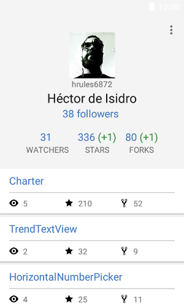
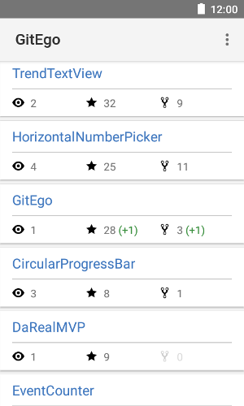

GitEgo
=====

This repository contains the source code for the GitEgo Android app.

GitEgo lets you track followers, watchers, stars, and forks for all your repositories on GitHub.

GitEgo is not associated with GitHub in any way.

### Download on Google Play Store

### Screenshots
 

### Libraries used in the project
* [Dagger](https://github.com/google/dagger)
* [ButterKnife](https://github.com/JakeWharton/butterknife)
* [DaRealMVP](https://github.com/hrules6872/DaRealMVP)
* [Gson](https://github.com/google/gson)
* [OkHttp](https://github.com/square/okhttp)
* [Picasso](https://github.com/square/picasso)

Developed by
-------
Héctor de Isidro - hrules6872 

License
-------
    Copyright 2016 Héctor de Isidro - hrules6872

    Licensed under the Apache License, Version 2.0 (the "License");
    you may not use this file except in compliance with the License.
    You may obtain a copy of the License at

       http://www.apache.org/licenses/LICENSE-2.0

    Unless required by applicable law or agreed to in writing, software
    distributed under the License is distributed on an "AS IS" BASIS,
    WITHOUT WARRANTIES OR CONDITIONS OF ANY KIND, either express or implied.
    See the License for the specific language governing permissions and
    limitations under the License.
